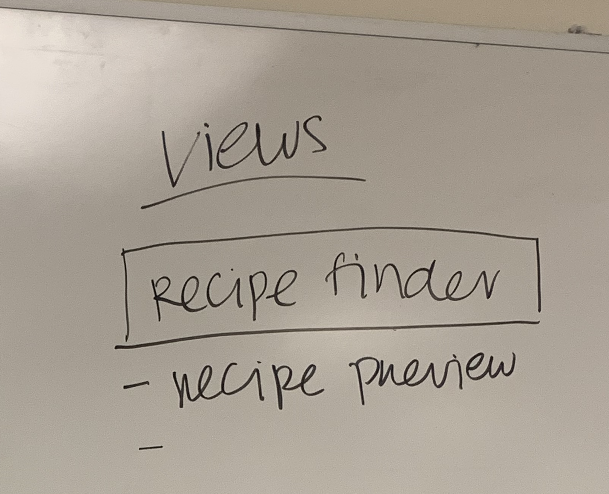

# Code Planning

## Group Details

- Project Team: Artemis
- Team members: Tomas Engquist, Celina Kim, Rachel Zhang, Konstantin Kirovski
- Project focus: Recipe App

## Introduction

- Overview
    - This document contains the plan we used to code our mobile app, the schedule we created for the coding, and an explanation of the capabilities of the finished prototype.
- Contents
    - Plan of App Architecture
    - Schedule for Coding
    - Prototype Explanation

## Plan of App Architecture

- Summary
    - Using our final wireframe to guide us, we planned out how to code our application on the whiteboard. We focused on what information should be stored in the JSON file, which parts of the apps are components, and what data will be needed for each screen. It is important to know that this architecture is subject change as the coding progresses and we see better ways of doing things.
- Overall App Architecture
    - 
- JSON
    - 
    - We decided to store the user's minutes, a list of recipes (each with a list of steps), a list of cooking materials, a list of the user's frequently bought ingredients, and a list of weeks each containing recipes inside.
- Components
    - 
    - We decided to have a component for the ingredient box, the add ingredient button, the meal history box, the recipe preview, and the recipe detail as these are all reoccurring elements.
- Views
    - 
    - 
    - The large screens of the app are the three screens of the recipe finder, the profile screen, and the meal history screen.

## Schedule for Coding

1. Populate JSON: **Tuesday, Nov 9**
    - 10 recipes
    - 5 ingredients
    - 5 materials
    - 2 weeks of recipe history
2. Create components to be used on screens: **Thursday, Nov 11**
    - Ingredient box
    - add ingredient
    - meal history box
    - recipe preview
    - recipe detail
3. Have screens UIs prepared for each view: **Sunday, Nov 14**
    - use JSON data to fill when possible
    - Profile
    - Meal history
    - Recipe Finder 1,2,3
4. Implementing functionality: **Tuesday, Nov 16th**
    - Display recipes based on time and ingredients
5. User testing: **Thursday, Nov 18th**

## Prototype Explanation

- My Kitchen
    - **Note: This is screen is made for the user to fill out when they use the app for the first time. To prevent graders from having to spend time setting up and to ensure they can see the recipes we included, we have pre filled it with mock data. Once you begin deleting ingredients, less recipes will appear in the Recipes section. For this reason, we recommend exploring the whole app before deleting any ingredients.**
    - There is a list of cooking materials that the user can check or uncheck to mark if they have the material. However, while the app is designed to display recipes based on the materials the user has, these inputs are not actually used to find recipes in the prototype as this function is not covered in our scenarios.
    - There is a an input and button to add an ingredient to a list of typically bought ingredients. You can enter an ingredient in the input and press enter or click add to add it to the list. The list has been pre populated with ingredients that we have created recipes for. You can delete an ingredient from the list by clicking the red X. You can delete all the ingredients by using the clear button at the bottom.
    - This list of ingredients in My Kitchen will be automatically used when the user tries to find a recipe in the Recipes section. If this list is edited, the list of ingredients in the Recipes section will updated to match it. However, editing the list of ingredients in the Recipes section will not affect the list in My Kitchen.
- Recipes (home page)
    - On the first screen, you can change the number in the input. When you get to the end of the recipe search, only recipes that take less than or equal to the amount of time you inputted will be displayed.
    - On the second screen, you can edit your list of current ingredients available. The ingredients shown are the ones you indicated you commonly buy in My Kitchen. You can delete an ingredient by clicking an X and add an ingredient using the input and add button. When you get to the third screen, only recipes will be shown that you can make with you current ingredients. A recipe will still be shown if you don't have an optional ingredient or you have a substitute for an ingredient that is listed in the recipe. You can clear all the ingredients using the clear button at the bottom.
    - On the third screen, you can see the details of on one of the recipes displayed by clicking anywhere in the recipe box.
    - Once you click on a recipe, you can click on Finished Recipe. However, while the app is designed add this recipe to the History section once this button is clicked, this functionality is not included in the prototype as it is not covered in our scenarios.
- History
    - The history section has been pre-populated with recipes that the user has already made. However, there is no interactivity included in the prototype for this page as it is not used in the scenarios.

