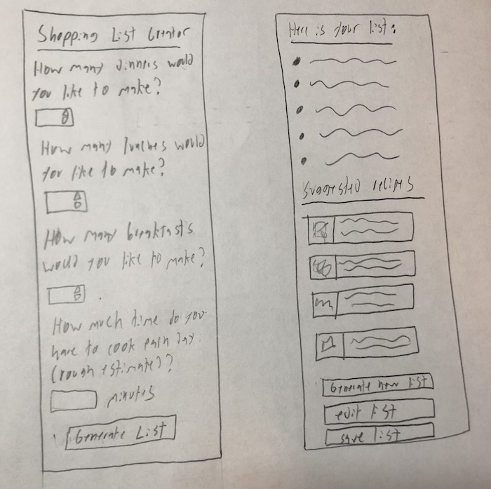
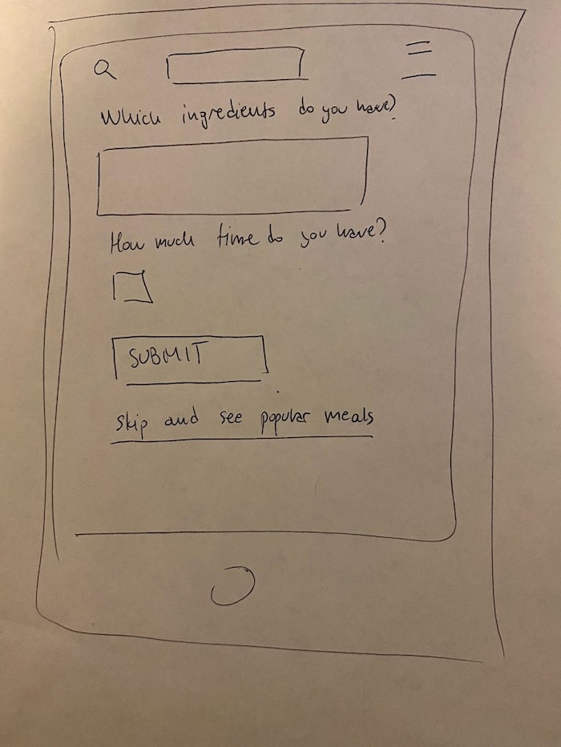
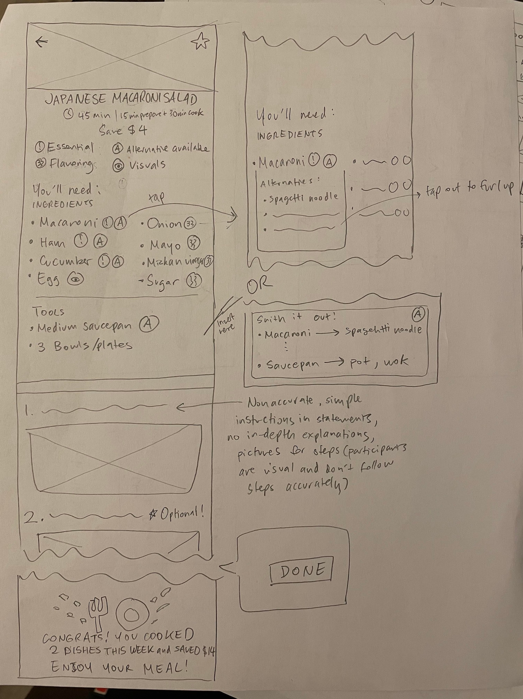
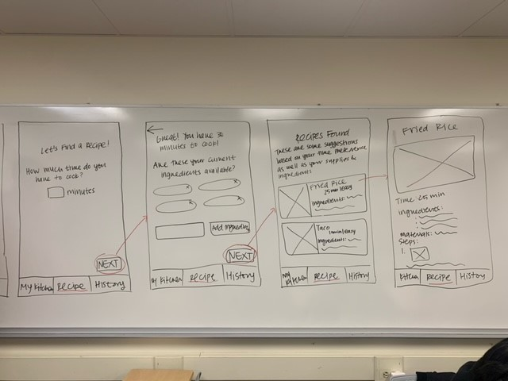

# Designing the Recipe App

## Group Details

- Project Team: Artemis
- Team members: Tomas Engquist, Celina Kim, Rachel Zhang, Konstantin Kirovski
- Project focus: Recipe App

## Introduction

- Overview
    - This file contains the process we took to design the recipe application. It will go through each state of design, starting with brainstorming and ending with a final wireframe with a rationale. Design is the next step after discovery and planning. We have learned about our users and specified our problem to focus on so now it is time to design the recipe app. The designs in this document will be based on the user group, user research, key problems, value propositions, scenarios, personas, and themes from our [Discovery & Planning](./planning.md). 
- Contents
    - Brainstorming
        - In order to come up with an initial set of ideas to iterate on, we mentioned ideas out loud and turned some into quick drawings on a whiteboard.
    - Sketches
        - We expanded on some of the ideas from the brainstorm by sketching them in more detail. We used the sketches to figure out what to include in the final wireframe.
    - Initial Sketches / Wireframes
        - We discussed all the sketches and which elements from them we wanted in the final design. Then we created the initial wireframe with those elements included.
    - Final Sketches / Wireframes
        - After receiving feedback on our first set of sketches, we created a brand new set of sketches with the final wireframes.
    - Rationale
        - We explain how our final design meets the needs of our users and aligns with our project themes, critical problems, personas, etc.

## Brainstorming

- Summary
    - In order to get the design stage started, we wrote a few details about our persona as well as our key problems on a whiteboard. We placed these at the center to help guide our brainstorming process. Then, we started discussing possible design ideas that address the problem for our persona, Ashley. For many of these discussed ideas, we made a quick sketch on the whiteboard. These sketches are extremely low fidelity. In fact, it would be more accurate to describe them as visual representations of the ideas. The sketches are not meant to be precise UI interface but visual representations of ideas.
- Rationale
    - We brainstormed this way in order to get our ideas out as quickly as possible. By not focusing on any fine details and moving fast, we were able to generate many different ideas without getting caught up with any one in particular. This allowed us to produce a wide variety of ideas that attacked the problem from different angles. Having a diverse selection of ideas will help us move on to the sketching stage where we will focus on a few features to sketch out in greater detail.
- Brainstorming Board #1
    - 
    - Explanation of ideas

        1: This is a pop up that appears when the app is opened. It simply asks "how much time do you have today?" The app can use this data to suggest recipes that Ashley has enough time to make.

        2: This is a regular search bar, except it is just for recipes. However, the search can take into account how long Ashley wants to spend cooking and what materials they have, information Ashley can record in her profile (idea 4)

        3: This is an input that Ashley can fill out multiple times with ingredients she has available. Then, the app will show recipes that use those ingredients.

        4: This is a profile page for Ashley where she can change her recipe preferences based on her needs. She can change the amount of time she wants to spend cooking and indicate what materials she has available. Other parts of the app can use this information to suggest convenient recipes for Ashley.

        5: This is a recipe screen, using banana bread as an example, that lists each ingredient with possible alternatives. It also shows which ingredients are optional.

        6: This is a recipe screen, using fried rice as an example, with a star next to it. The star indicates how difficult/time consuming the recipe is, helping Ashley figure out if its good for her.

        7: This is a representation of the app taking a photo of a shopping receipt and storing the ingredients in Ashley's virtual fridge. The app can use this information to suggest possible recipes.

- Brainstorming Board #2
    - 
    - Explanation of ideas

        1: This feature allows Ashley to click a tool, or a combination of tools, to indicate what she has available to use at the moment. For example, she can click 1 fry pan to indicate she wants recipes that can be done using just 1 fry pan.

        2: This feature allows Ashley to select how long she wants to spend cooking for each meal in a given week. The app will then create a recommended shopping list for her along with recipes for that week that adhere to her time boundaries.

        3: This is a screen that allows Ashley to submit what she has made in the past. It then displays simple variations of dishes that she has made.

        4: This is a screen where Ashley can record and keep track of her favorite meals. The app can use this information to suggest similar recipes in the future. They will be similar in terms of food and how difficult the recipes are.

## Sketching

- Summary
    - After rapidly brainstorming many ideas, we decided to move on to sketching features with more precise user interfaces. Our plan was to use the ideas we came up with and select several to expand upon, iterate, and possibly combine. Each member of the team was tasked with sketching features independently. These sketches are low fidelity and their main purpose to communicate how the feature will look and function. 
- Rationale
    - While the brainstorm helped produce a variety of ideas, we need to select which ones we want to consider including in the final design. By sketching out the interfaces for these ideas, we can see which features are easy to communicate with an interface. However, it is still important to keep the sketches low fidelity because we will be making many iterations before reaching the final design. At this stage, the most important goal is to figure out what ideas to move forward with, not to make a perfect wireframe.
- Tomas Sketches
    - Idea: Profile preferences
        - 
        - Explanation
            - The profile preferences idea seeks to solve both of the key user problems by allowing Ashley to input her cooking circumstances. The recipe portion of the app can take these circumstances into account when providing recipes for Ashley to use. For example, if Ashley indicate she wants to spend no more than 20 minutes cooking dinner, she will never see a recipe that takes longer than 20 minutes. If Ashley indicates she has a stove and a fry pan but not an oven, she will only see recipes that use a fry pan. While speed is a vital theme to the application and filling out this preference page will take time, Ashley will only have to fill it out once. Occasionally she can update it if her preferences change or she obtains or loses some cooking supplies.
    - Idea: Shopping List Generator
        - 
        - Explanation
            - The shopping list generator is designed to help Ashley shop for ingredients. It provides Ashley with a shopping list for a weeks worth of food. Ashley can indicate how many meals she wants to make and how much time on average she is looking to spend cooking each meal. The generator will give her a list of items to purchase along with accompanying recipes for those items. If Ashley does not like the list, she can edit the list or generate an entire new list. Either way, the recommended recipes will automatically adjust. However, a key disadvantage of this feature is that Ashley will have to predict how much time she will have for a week. This is a difficult number to come up with. When conflicts arise, she will not have time to make some of the dishes in a given week.

- Konstantin Sketches:
    - 
    - Explanation of ideas
        - The profile page in the mobile app allows users to keep the track of the recent recipes, and get access to them easier if they want to make them again. Also, a skill level is an indicator at the cooking skills that user currently has, from beginner to expert. There is also a progress bar on the side of it which demonstrates to the users how more do they need to cook to reach the next level, with the exact number of dishes written below. As we have learned in terms of persuasive design and different behavior models, there are three different dimensions. In terms of motivation, users can often stop using the product because the lack of it after some time, having no desire to continue. The progress bar would stimulate the users by showing them the constant improvement that they make after making each dish and stimulating them, no matter how how the cooking can be, to continue preparing their food to master their cooking skills. 

    - 
    - Explanation of ideas
        - The home page gives user a chance to filter between different recipes and quicker find the information they need, based on the time and ingredients that they have at the moment. As one of the main problems in our research was the time management and not having enough time in general, this part of the app would quickly generate different recipes based on the input of the users (their available ingredients as well as the time they have at the moment). On the other side, users will not be forced to submit this form because we understand that, as we have seen in our interviews, browsing through recipes and finding the interesting ones with pleasant pictures can often times be appealing as well. Thus, we have decided not to make the form required. 

    - 
    - Explanation of ideas
        - Lastly, at the top of our page, user can search for a particular recipe that they want to make, given that they already know the name of it. The stars, with appropriate labels and icons, indicate the difficulty of preparing each meal, making it easier for users to understand whether their skills match the meal they are looking for. Additionally, the time required for the preparation of the meal is also listed so that the user know whether they will have enough time to make it, as well as detailed preparation instructions and ingredients that are required. This information would help users better understand whether they have required ingredients, enough time, or enough skill to prepare this meal. At the bottom, there is a message that indicates to the user how much money they would save if they make this meal, instead of ordering it for delivery. This method of persuasive design is there to stimulate users motivation. The time management is the biggest concern for the users and thus they can find it much easier to just order food online. However, by clearly labeling the exact amount of money that the user will save, we can motivate them to continue to use our product and thus save money for each meal. The total amount of saved money (since the app was installed) will be displayed in the user's profile, so that whenever they log in they can see it. We have seen how the motivation changes over time, and that the users might lose the willingness to use our product if the tasks become harder. However, our recipes will not change and they will always be able to make the ones that are easier for them, and thus not worry about the lack of abilities aspect. The total count of the saved money would prevent the lose of motivation to occur over time, and this is how we would try to persuade the users to continue using our product and cook meals for themselves, instead of ordering delivery, over a longer period of time. 

- Rachel Sketches:
    - Idea: Recipe search & Display
        - 
        - Explanation: This design expands on the pop-up and search bar from brainstorming. The recipe search process is meant to quickly get down to business by getting the most important information from the user, Ashley, (time, ingredients, and meal) and using that information to generate some recipes that fit the Ashley's needs. This is based off the user research which told us they thought cooking took more time and effort than getting takeout, so it reduces that gap, and that they don't have the ingredients, so it bases it off the ingredients they already have. It asks for the number of minutes she can cook, the ingredients she has, and what kind of meal she wants. It will ask this at the startup every time because Ashley might have days where she has more or less time to cook. There is an image for the recipe because Ashley's habit is to decide what to cook based on visuals first. Since Ashley doesn't spend a lot of time looking for a recipe she likes, there are only 3 recipes that are shown at once and all the critical information is laid out: what ingredients she has matches with the recipe, and what she doesn't have but might have alternatives for, and what is optional, clearly laying out all the information she needs to determine if she can make this recipe. The last aspect is to show how much she can save by making the dish herself. For Brett, saving money for his tuition is important for him, so it might convince him even more to cook instead of get takeout.

    - Idea: Recipe Alternatives & Steps
        - 
        - Explanation: This design expands on the recipe screen from brainstorming. Recipe Alternatives shows what is necessary for the dish Ashley is interested in and the steps to it. There are icons that indicate what is essential, has alternatives, just for flavoring, and just for visuals. Some of the ingredients that a recipe calls for might complicate the recipe but it could be hard to tell what is "decoration" for the recipe. This highlights those ingredients to indicate they are optional and offers alternatives for all ingredients. It also gives the steps in a very concise way with lack of exact measurements and points out what steps might not be necessary since Ashley doesn't really follow recipes exactly and could save time by cutting out certain steps. Based on the ingredients she has, she can follow a "choose your adventure" but for cooking. By doing this, it decreases their effort and might add more fun compared to ordering takeout. Once they complete the dish, it tells Brett how many times he's cooked during the week and how much money he saved which might motivate him to cook more often to increase both.

    - Idea: Recipe Essentials
        - 
        - Explanation: Recipe Essentials caters to Ashley's behavior of not following a recipe accurately in the first place and might want to make something using very basic ingredients, which is what she buys. It also caters to Brett who doesn't want to buy niche ingredients that would only be used once and eat simple meals. Since it is only the essential ingredients to create the dish, it would be very simple as it cuts out the preparation of other ingredients and extra steps of cooking. In this example, an 8-step recipe might just be 5-steps. As a part of the essential steps of a recipe, it provides alternatives if Ashley or Brett doesn't have the ingredient or tool, which also targets their concern of not having the right components for the recipe - or makes it easier for them to decide if the recipe will be possible for them. 

    - Celina sketches
     - 
        - Explanation: Since saving time is a big concern for Ashley and Brett, both being busy students, it is essential to keep many aspects of the app hassle free and simple. The profile page will only include vital information such as the usual amount of time they prefer to spend cooking. This will be used to generate recommended dishes, though they will also have the option to customize their time limit option on the recipe finder page. Since not having enough materials for certain dishes was a concern for Brett, a section where users can input the materials they have was included. While the ingredients a person has in their fridge frequently changes, the materials/utensils they have often do not change. Therefore, it was found that it was appropriate to include it while the user is generating their profile, as it will be a one time input for many. However, if they happen to get more materials in the future, they will have the option to edit. 
     - 
        - Explanation: Having limited ingredients to cook certain dishes was a concern for Ashley and Brett. By inputting the ingredients that they have available, it will help them find dishes using the ingredients that they have. However, since both Ashley and Brett usually buys similar ingredients or ingredients they know that they will eat, once they input the name of the ingredient, they will also have the option to just update the quantity of that ingredient. That way, they won't have to re-enter the name of the ingredient every time they buy it, but just update it as they go. 
     - 
        - Explanation: The recipe finder page is catered for both Ashley and Brett to find the meal that best suits their situation. They have the option to search a specific recipe if they so desire. However, they are also provided with filters so that they can filter their dish options depending on what they are looking for. The recommended option will display meals that fits to everything that they have input in their profile page (materials and time) and ingredients page. Since both Ashley and Brett do not have many options or time to go grocery shopping often, they can unselect the ingredients to display meals that fit to their materials and time but not ingredients. This will help them pick meals in advance before going grocery shopping so they know exactly what to get when they go, and help with Ashley meal prep and prevent Brett from purchasing ingredients that he will not use. The time filter is also there in case the users have more or less time to cook, which in that case they can edit the time. The meal cards themselves will display the image of the food to allow a quick skim, the name of the dish, the difficulty of making the dish (as displayed by fire emojis), as well as how much the user has in terms of ingredients and materials to successfully make the dish. By seeing all the necessary information before seeing the detailed view, it will save Ashley and Brett the time it takes to look for recipes. 
     - 
        - Explanation: The recipe page was kept simple since Brett does not have much experience in cooking. In order to allow individuals of all cooking skills to be able to follow the recipe, it is important to keep it detailed yet simple and clean to look at and use. If it is too cluttered, it will overwhelm beginner cookers when they are trying to cook. Additionally, even for individuals with more cooking skills such as Ashley, given the fact that she does not have much time to dedicate to cooking, it is also important to keep it clean and easy to look at so that she doesn't have to read paragraphs and paragraphs when she is following the recipe. 
     - 
        - Explanation: Ashley and Brett both want to save money on food, but often times, especially in the case of Ashley, they decide to still buy food outside because the convenience outweighs the cost. Often times, users know that cooking by themselves save money, but it is hard to visualize how much they are actually saving. However, by providing a explicit visualization of the money they are saving on food by deciding to cook (perhaps can incorporate how much they spent on groceries vs. buying food) can help them realize that they are saving a lot of money and give them more incentive to cook. 
    

- Notes on sketches
    - This section is the feedback and notes that we had about each others sketches. These include ideas we like, ideas we dislike, recommendations for changing ideas, etc.
    - Tomas
        - I think Konstantin's profile page may be too distant of an idea as it doesn't really directly provide a solution to the issues of time and materials. In addition, complex recipes may not be appropriate for Ashley and Brett.
        - I like Konstantin's homepage because it provides a quick solution to Ashley's problems by taking time and materials into account. Not having too many steps is one of the important project themes.
        - I think Konstantin's recipe page communicates a lot of important information to our persona's about the recipe, although it doesn't look too different from recipes online. The added touch of money saving is good encouragement for users.
        - I like Rachel's search & display because it puts the critical problems front and center. Perhaps it could be combined with my kitchenware part of my profile page to make sure Ashley has the right tools for the suggested recipes.
        - Rachel's recipe alternative's screen may be a bit overwhelming because there is a lot of information. However, it is good that it incorporates the motivation value proposition.
        - Rachel's only the essentials page has great simplicity that could save Ashley and Brett time and energy when it comes to cooking. It aligns well with the project themes such as speed, steps, amd self-explanatory.
        - Celina's profile page is quite similar to mine. The idea of having Ashley and Brett's preferences saved to use in other features is clearly popular and I think it should be included in the final design.
        - Celina's fridge screen has a valuable utility, even more useful than the profile page. However, because Ashley and Brett don't have much time, consistently updating the fridge is too much to ask.

    - Rachel
        - I like that Tomas' profile preferences is very detailed and makes sure that all the concerns of Ashley regarding ingredients, tools, and time preferences are met (especially through max time). If Ashley has a very routine schedule, this would work well, but there may be times where she has more or less time and if she puts 1 hr to be on the general side, it might still take time to find recipes that take less time because of the max range. While the other preferences page is also interesting, it might not match with our value propositions and project themes.
        - Tomas' shopping List Generator is a unique approach to the problem. The personas show that they mostly buy the same ingredients each time because they know they will use it. Having to edit the list and as Tomas mentions predicting the number of meals might take time and demotivate the user from using the app. I also wonder about the feasibility of generating a list of ingredients just based on number of meals.
        - I like that Konstantin's profile page has a skill level because it gamifies the experience of cooking and can serve as a motivating factor. Perhaps more stats can be added to this to also target the user's other pain points.
        - I like that Konstantin's home page is a straightforward approach that targets Ashley and Brett's problems, I wonder if having "skip and see popular meals" might be an incentive for them to disregard and just click into it instead of inputting their information.  
        - Konstantin's idea of having the time specified is good so that the user can gauge for themselves if they can cook something. I think this idea is a bit too similar to regular cookbook recipes and might not be targeted enough to our value propositions and user problems.

    - Konstantin
        - Tomas' profile preferences is very detailed and addresses all the issues that Ashley has. I specifically like how this idea solves the problem of time constraints for Ashley, and in his explanation Tomas mentioned that only the recipes within the time preparation limit will show up. This really makes it easier for Ashley to quickly then scroll over the recipes and not worry about the time it might take for the recipe to be prepared. Additionally, the filters for food are very specific making it easier for Ashley to see only the recipes that she is interested in, consequently solving the main issue - lack of time for preparation.
        - Tomas' shopping list generator is an interesting idea that would, again, solve Ashley's problem of lack of time. However, I am struggling to understand how would list generator be given to Ashley based on the number of times they would like to cook. Also, Ashley's main problem is lack of time, so it might be difficult to understand how much time she will have in 5 days from the time she is generating the list.
        - Rachel's searching page is very detailed and I like how it generates the recipes based on the filter that Ashley choose. It might be better to include it into the profile, so that the user doesn't have to see the pop-up screen every time they log in to the app. It can perhaps be combined with my profile page, with including Tomas' tools items. 
        - I like how Rachel's recipe alternatives screen communicates to Ashley with icons and labels that are associated with it. Perhaps there could be a bit less information on this page, because currently it might be a lot of information for every single meal and I am not sure if all of that is important. 
        - Rachel's essentials page is great for both Ashley and Brett! It solves the main problem of lack of time and helps our personas to understand only the necessary information about the recipe. Simplicity is something that is great about this idea as well!

    - Celina
        - I like the UI of Rachel's recipe search and display, and how it guides the users through the process. However, my only concern is that it will take the users a long time before they can even see the recipes if they have to input the time, ingredients and preferences every single time. Especially since Ashley does not have much time to dedicate to cooking, the number of steps it takes to see the recipes might discourage her from frequently using the app. 
        - I really like Rachel's alternative recipes page as it caters to the needs of both Ashley and Brett. It is perfect for both since they might not have all the necessary ingredients since both usually buys similar ingredients, and Ashley doesn't accurately follow the recipe and Brett is a beginner cook. 
        - I like Tomas' profile page as it also takes into account Ashley and Brett's preferences with food. This will also help ensure that the recipes that are displayed fit to their needs -- if many of the recipes reflect their needs AND their preferences, they will be inclined to use the app more. It also takes into account materials, which was a concern for Brett. 
        - Tomas' shopping generator sketches are also very good for both Ashley and Brett. Since both often do not have the time or ways to go grocery shopping often, by helping them plan ahead can be a great way for them to save money and time. Especially since Ashley also wants to start bringing food on to campus (meal prep), this can also help her achieve her goals of doing so in a more efficient manner. 
        - I like how Konstantin's profile page includes skill level to account for Brett, who is a beginner and have a statement on the bottom saying "you need to cook two more meals to advance on to the next level". It's a cute touch that almost feels like a game/quest. However, my concern is that cooking a certain number of times doesn't necessarily drastically improve their skills, especially if they only cook very easy meals. While it is a creative idea, it also doesn't necessarily address Ashley and Brett's main concerns with cooking instead of eating out. 
        - For Konstantin's recipe information page, I like how on the bottom it reiterates how much money they are saving compared to buying out. Since both Ashley and Brett's needs and wants are to save money, it will help them motivate to cook more if they constantly see how much they are saving by cooking.

## Initial Sketches / Wireframes

- Summary
    - After independently sketching many ideas, we discussed our feedback about the ideas in person, reviewing the notes we made in the previous section. We determined what features we thought were the best and excluded some features that we thought had issues. The following wireframe is a combination of the ideas as well as some new ideas that we thought of during the in person meeting.
- Profile preferences
    - 
    - Explanation
        - The profile page allows Ashley and Brett to tell the application about their food and kitchen situation. Once they record what kitchen materials they possess and what kind of ingredients they usually buy, the recipes that will be recommended to them in the recipe finder will match their needs. For example, if Ashley indicates she has a pot and a frying pan and she typically buys broccoli and asparagus, then she will see recipes using a pot and frying pan for those specific vegetables. If Ashley decides buys a new tool or stops buying a certain ingredient regularly, then she can visit the profile page and change her settings. However, Ashley and Brett will not have to update this page very often as user research showed that they typically buy the same ingredients every week. In addition, having these preferences saved will save them time while searching for a recipe and ensure the recipes provided will use ingredients and materials they have.
- Meal history
    - 
    - Explanation
        - This screen is there so that the Ashley and Brett can easily see which meals they made each week. If they want to see previous weeks, there are left and right arrows which communicate clearly with them that they are moving dates forwards and back. A small image of the meal (taken from the recipe page) will be displayed above the description so that it is easier for them to connect the information about the meal with the picture, rather than having to read over it again. Since Ashley's and Brett's main issue is not having enough time for cooking, this feature would also allow them to access their recently made meals and not have to search them again, if they want to make the same meal. Additionally, at the bottom of the screen, based on the number of meals that Ashley or Brett made this week, the amount of saved money will be displayed. Taking into consideration that the average delivery costs around 1$15, and that the meal preparation costs around $5, the difference ($10) will be added to the saved weekly amount for every meal. This is also an element of persuasive design that we wanted to implement in our page. Although ordering delivery takes less time and users often lose motivation in using a certain product after some time, this is a method that we want to implement to convince users to keep using our product and motivate them additionally. The constant display of money saved for each week would keep Ashley and Brett interested in saving more money each week, and the simplicity of preparing some of the meals and the time needed for them will keep their motivation for using the app high. 
- Recipe finder stage 1
    - 
    - Explanation
        - This screen is the first screen Ashley and Brett will see when they open the app after their initial profile setup process, and it's the first part of the recipe search process. It asks them to input how long they have to cook this meal so that the following recipe search can filter through all the recipes and only display the ones that fit Ashley's/Brett's time limit. Afterwards, they can go immediately to the next step.
- Recipe finder stage 2
    - 
    - Explanation
        - This screen is the second part to the recipe search process. The ingredients listed on the screen as removable selections are based on what Ashley and Brett had inputted in their profile page as ingredients they typically buy. This saves them time as they don't need to input all the ingredients they have or want to use each time, rather removing the options they know they don't have is faster since it only requires a single click rather than typing out the ingredients. We still allow Ashley and Brett to add ingredients as they might make special purchases sometimes. This search process is worded similarly to a human conversation.
    - 
    - Explanation
        - This screen displays all the recipes filtered from the inputs before. The screen has 3 recipes shown initially because Ashley doesn't like to spend more than 5 minutes looking for a recipe. Limiting the recipes first will give her her top choices and prevent her from scrolling more to look through other options right away. If she wants, she can still open see more to see more recipes that fit her criteria. Each recipe on the results page shows an image of the dish because Ashley bases off her recipe choice on how good the visual looks. The overview of the recipe includes the name of the dish, how much time is needed (so that they can see it will take around the time they had inputted to make), the difficulty level (to gauge their skill and perhaps increase or decrease the time it will take to make it), and the essential ingredients for the dish. That way, it will clearly display whether or not she has an essential ingredient and perhaps she can see if she has an alternative for the missing ingredient by clicking into the recipe. The recipes on this page already tailors to the kitchenware Ashley had inputted on her profile, so she doesn't have to worry if she needs extra things before starting. If she wants to change her search, she can go back and edit her responses.
- Recipe detail
    - 
    - 
    - Explanation
        - The recipe details page displays the more thorough breakdown/full list of ingredients as well as the steps. Next to the ingredients, distinctions between what is optional and what is not, and what are some alternatives to the ingredients are have been listed. Since Ashley and Brett both often buy the same ingredients all the time, in order to account for some ingredients they might not have, the optional and alternative ingredients have been labeled. Pictures are also included in the steps for beginner cooks like Brett, since pictures communicate more and are easier to understand than specific measurements (such as a "put in a dime of soy sauce"). The pictures also aid busy students like Ashley and Brett both to follow the recipe easier, since they can look at the picture, which is a lot faster than reading all the words. All design choices in the recipe detail page was made to account for busy students with varying cooking abilities, and limited ingredients and materials like Ashley and Brett. At the end of the recipe is a complete button, which they can press after successfully cooking the dish. Once pressed, the information about the meal they cooked as well as the money they saved will be tracked in the meal history page.
    

## Final Sketches / Wireframes Updates

- After receiving the feedback, the team has decided to alter the final wireframes. Those changes, alongside the explanation for the specific change, can be seen in the section below:

- Summary
    - Based on the feedback that team got on our previous milestone, we decide to implement the navigation bar at the bottom of our screen. The reason for that is because we are designing a mobile application which usually consists of a navigation bar at the bottom that easily allows users to move from page to page. Previously, we did not have a navigation bar indicated at all and we have decided to include it in our sketches. The other change that the team decided to implement is the naming of title on the initial setup for the purposes of better communication (this is explained in more detail below). Lastly, the pop-up message when the meal has been prepared is included to provide feedback to the users that their action is complete and successful, to make the overall communication more clear. The red arrows indicate the connection between different wireframes, which is also something that we have added for our final wireframe implementation. 

- Profile preferences
    - 
    - Explanation
        - First and foremost, we have decided to change the title from 'Profile' to 'My Kitchen'. We thought that the 'Profile' title does not communicate clearly to our personas what is expected from them on this page. We have also supported the effective communication by adding an additional line of text below it to specify what is needed from Ashley and Brett. The overall change of title and an additional explanation of the page helps us communicate our ideas. This page is going to be the setup page which users can go back to by clicking on 'My Kitchen' in the navigation bar (indicated in the sketch that they are currently on this page). The rest of the information remains the same, and the explanation for those has already been written above. One last change is the 'Next' button' which we decided to remove from this screen. The changes that Ashley and Brett make while inputting the ingredients or clicking on the checkboxes for materials are already saved once they add them. We thought that the next button is not necessary in this case because it is a little unclear what would happen when the users click on it. Thus, we have decided to eliminate it completely. 

- Meal history
    - 
    - Explanation
        - Meal history has remained the change, but with the addition of the navigation bar. The 'History' label indicates to the user that this is the page where their recent meals are stored, and once they are on the page the 'Meal History' label helps communicate this even more effectively. The content of the page remained the same, and thus the explanation is unchanged from the previous part. 

- Overall Recipe Flow
    - 
    - Explanation
        - This is the combination of the 4 wireframes and the overall flow of finding a recipe. Since, other than the navigation bar that has already been explained, we did not change the initial wireframes, we have just added the arrows that indicate the connection between them.

- Finished Recipe Confirmation
    - 
    - Explanation
        - When Ashley scrolls down through the recipe and finishes it, she sees a big 'Finished Cooking!' button. We decided to implement it to better communicate with Ashley what will happen when she clicks on it. We thought that the label that we decided to include previously did not communicate well enough because it was broad and decided to communicate more specifically. We have also decided to implement a pop-up message as a response when user clicks on this button. The reason for that is because we wanted to communicate with the users and provide adequate feedback to them, so that Ashley knows that her actions have been saved and her recipe has been added to the history. By having adequate feedback messages, Ashley is able to understand that the app has responded to her action and this is why we have decided to include the pop-up in such way. 

## Design Rationale

- The entire design process was conducted with the personas and the project themes in mind. The app was designed with simplicity with limited steps needed to reach the goal in order to ensure that the user will be able to find the recipe they want in an efficient and speedy manner. Since both of our personas, Ashley and Brett are busy students with limited time, ensuring that they are able to find the recipes quickly was the key focus point of our design. After the initial set up page, which will take the longest out of all other components of our app, everything else should be done fairly quickly as the app generates recommendations based on what they had input. Additionally, we have included pictures in the recipe steps as well as providing alternative ingredients and labeling what is optional, so that they can cook the dishes quicker with the limited ingredients that they have. This also eliminates situations where users will be discouraged because they found a meal to make but they do not have all the necessary ingredients. 
- We have also incorporated explicit description of the time and difficulty of making the dishes, so that Ashley and Brett knows exactly what to expect when they decide to make the said dish; this will encourage to cook and assure them that making food will not take long. Since the first part of finding the recipe requires the users to input the amount of time they have available to cook, it ensures them that all the recipes they find will be within the time limit that they have. This was another important thing that went hand-in-hand with speed, as both of our personas have limited time to cook. 
- Lastly, much of our application is designed in a step-by-step process, starting from the users inputting the time they have, checking the ingredients they have, selecting the dish, and following the recipe. This was to ensure that Ashley and Brett will be able to navigate and use the app without much investigation. We also utilized explicit text for difficulty and time it takes, as using symbols for things like difficulty can create ambiguity. The overall design was made for it to be intuitive, quick, and efficient for our personas while keeping in mind the project themes that we have identified previously.