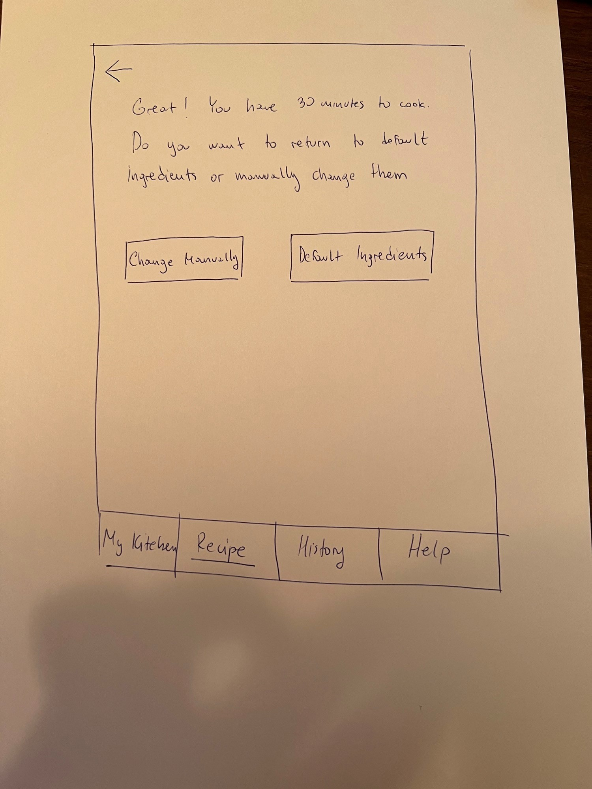

# Testing and Evaluation

## Group Details

- Project Team: Artemis
- Team members: Tomas Engquist, Celina Kim, Rachel Zhang, Konstantin Kirovski
- Project focus: Recipe App

## Introduction

- Overview
    - This document contains the scenarios and tasks we used for user testing, the notes from the user tests, and a group analysis of the notes. Notes about the test itself, the conversation after the test, and a summary of design issues are included for each user.
- Contents
    - Scenarios and Tasks
    - Testing Notes
        - Includes notes for each task, debriefing notes, and design problems.
    - Synthesis of testing notes
    - Summary of debriefing notes
    - Sketches for potential improvements

## Scenarios and Tasks

- Summary
    - We evaluated our recipe app by testing it with users for our scenarios. 
- Scenario 1:
    - Ashley is an undergraduate student at Cornell University who lives off-campus and is not enrolled in Cornell's meal plan. Thus, to save money, it is important that Ashley cooks meals for herself. Cooking the same meals over time becomes boring for her, so she wants to experiment with online recipes. However, Ashley is worried that finding recipes and preparing food may take a lot of her time. Meal preparation is very important for her, but she wants to make sure that it doesn't take too much time so she can study. Ashley decided she only had 15 minutes to make her meal. Ashley used the recipe app to find a recipe she liked that only took 15 minutes and she found that banana bread matched her criteria. Since she had all the ingredients and relevant skills to make it, she decided to make it. After successfully baking banana bread, Ashley felt good that she was able to save her time and money by preparing a quick, but delicious meal of her choice instead of ordering food online. 
    - Tasks:
        - You are a very busy undergrad student at Cornell University. Between now and your next meeting, you have 20 minutes to make dinner. Find a recipe that you can make given your time limit. 

        - You found that your meeting got postponed 10 minutes, so now you have 30 minutes to cook dinner. See if there's a recipe you might want to try now that you have more time.

- Scenario 2:
    - Daniel is a junior at Cornell University who just moved out of the dorms this semester and is not enrolled in Cornell's meal plan anymore. Thus, he usually goes to the store once a week to buy certain ingredients that he thinks he could use during the following week. He does not have a list of items that he needs before going to grocery store and he usually buys stuff that he sees while walking around. After coming home, he found that the ingredients were difficult to figure out how to pair together. Using the app, he was able to find a recipe using the ingredients he had just bought, making him feel satisfied with the choices he made during his grocery shopping.
    - Task:
        - You are a busy undergraduate student at Cornell, so you do not have time to cook that much. While in the store, you rushed your grocery shopping and bought only pasta, heavy cream, onions, butter, and tomatoes. Find a recipe that allows you to prepare a meal with these ingredients. 

- Scenario 3:
    - Kelly is an upperclassmen at Cornell University who lives at an off-campus studio far from campus. Since she lives far, she spends most of her day on campus and resorts to purchasing food from restaurants or from stores on campus. She wants to start cooking more and perhaps plan her meals to save money. It's been about a week since she went grocery shopping, and she has very little ingredients left in her fridge. Additionally, because she lives alone and doesn't normally cook often, she has very limited tools she can use to help her cook. Using the app, Kelly came across a very simple recipe that she was able to cook in between her classes. She didn't have all the main ingredients but she saw there were several alternatives listed and she had those alternatives in her fridge. She was very happy that she was able to eat a good meal while saving money. She hopes to find more recipes like the one she found so that she can cook more and not waste the food in her fridge as well.
    - Task:
        - You are an undergraduate student at Cornell and are having a friend over for dinner. You want to make Macaroni Salad but don't have cucumber or Spam Ham. Figure out what ingredients you can use as alternatives.

## Testing Notes

#### User 1
- Facilitator: Tomas
- About user
    - The participant is a female senior at Cornell University studying Healthcare Policy who lives in apartment in Collegetown with 1 roommate.
- Testing notes
    - task 1
        - Went to recipes right away amd quickly changed the time
        - Clicked next without hesitation
        - On the next screen with ingredients, she paused for a moment to look at the ingredient list, seemed like she was a bit confused
        - Ended up clicking on an ingredient and seeing nothing happen
        - Finally she scrolled down and saw the next button and pressed it
        - Selected veggie bowl for dinner
        - Said the task was easy to find a recipe, but the task didn't specify what ingredients she had
        - Wasn't sure that the add ingredient button was for but guessed correctly
        - To start the 30 minute recipe, she quickly used the back button a few times
        - No problem finding a 30 minute recipe
    - task 2
        - Quickly decided to delete all the ingredients she didn't have
        - Seemed a bit annoyed at how long it took her to delete all the ingredients
        - Had to hesitate a few times to remind herself what ingredients she had
        - Once left with the ingredients in the task, she clicked next and saw she was able to make the pasta.
        - Overall she completed the task very easily and clearly understood what the ingredients list was for, perhaps because she was exposed to it during previous task
    - task 3
        - Said the task seems challenging right away
        - All within about 10 seconds, she went to recipes and clicked next twice and saw the macaroni dish
        - Once on she was on the detailed page for macaroni, it took her about 5 seconds to identify the substitutes.
        - Said she was confused in the beginning because she thought there may have been a search function for substitutes, but then she realized if she went to the recipe the substitutes could be there
        - She said it should be more clear that substitutes are listed in ingredients list.
- Debriefing notes
    - Said that she understood the idea of the app right away, to find recipes that are possible based on the materials, ingredients, and time that the user has.
    - Wasn't sure how the ingredients in My Kitchen related to the ingredients in the recipes function, but correctly assumed that the ingredients in My Kitchen determined the starting ingredients in the Recipes App.
    - Said the design looks nice and clean, the worst part is she had to delete many ingredients for task 2.
    - Said that she would use this app herself and liked the ingredient feature a lot.
- Design issues
    - Too many typical ingredients
        - Because there were a lot of ingredients set in the My Kitchen section, when the user had to narrow down the ingredients list to search for a recipe for task 2, it took a long time to delete every ingredient she didn't have. While this was absolutely necessary to complete the task, the user should not have to spend too much time finding a recipe as that is one of the most vital project themes.
    - Connection between My Kitchen and Recipes
        - While the user understood the general idea of the app, they were unsure how the My Kitchen ingredients were connected to the ingredients in the Recipes section. Even thought the user assumed the right connection, there should be no moments of confusing or hesitation. We need to communicate that connection better

#### User 2
- Facilitator: Rachel
- About User
    - Kaitlyn (pseudo) is an undergrad student at Cornell who lives off campus and cooks about 2-3 times a week.
- Testing notes
    - task 1.1
        - She immediately clicked on "recipe" and inputted her time. 
        - Slightly confused at first if she's supposed to choose the ingredients that are being shown to her or if shes supposed to X them out. 
        - She sees the add ingredients and comments that it's interesting she can type and add any ingredient. 
        - Says that she just intuitively wants to put in ingredients for recipes she knows (rather than all the ingredients she has). 
        - Crosses everything out and tries to add her own. 
        - Slightly confused about whether the ingredients is for the recipe she wants to cook with or everything she has. 
        - Continuously had "sorry no recipes found" page come up
        - After adjusting multiple times and getting more frustrated/confused/inpatient, she only found one recipe (banana peanut butter). 
        - Clicks on it and scrolls through it. 
        - Asks what does "Finished recipe" button means. 
        - She clicks see meal history and is pleasantly surprised that she made many meals this week. "amazing". 
        - Notes that it didn't find the recipe that she wanted when she added some ingredients and crossed others out.
    - task 1.2
        - Goes back to recipes using nav bar
        - Enters in 30 min and sees more results and is slightly surprised.
        - Sees shrimp fried rice, clicks on it and scrolls and says it looks good. 
        - Goes back and looks at the other ones. 
        - Says she wishes there were video/image instructions bc typically recipe websites and she'd feel more confident about how to do the recipe. 
        - After clicking finished recipe, clicks history and thinks it's cool. 
        - Is curious how $30 a week is calculated. 
    - task 2
        - Chose to start off in the "my kitchen" tab.
        - Immediately she is confused, reads the words on the top but still expresses confusion. States that she might be able to find a recipe from here.
        - She started clicking x for every single ingredient that she didn't have, says its very tedious. 
        - States shes not sure what the purpose of this section is if she can't see all the recipes after making the adjustments - shows shes confused about how this page works. - Switches to recipes tab instead after stating she's not sure where to click after deleting and removing ingredients from the my kitchen tab
        - On time page, says if she has unlimited time she doesn't know how much minutes to put in the section; inputted 100 minutes
        - She got no results from it. 
        - Feels frustrated about having to remove all the ingredients she doesn't have, said more than once it's tedious
    - task 3
        - She immediately selects a recipe 
        - Sees the "other than __" and reads it out. 
        - She thinks that's great. There's more options. But also states she doesn't know which combos taste good with each other alternatives, like what if celery doesn't taste good with tuna.  
- Debriefing notes
    - She asks if the answers from the top of the My Kitchen page (the materials list) influence the recipes shown. 
    - Thinks it'll be cool instead of crossing it out, you select preexisting options (similar to handshake, you select what you do have or what you're looking for.) 
    - Thinks it might be nie to get nutrition info/calorie info for the recipes as well.
    - Finds the presentation of ingredients overwhelming because theres lack of groupings.
- Design issues
    - My kitchen doesn't make totally clear its purpose and lacks conversation or it ends abruptly
        - Kaitlyn seemed to be confused about how to use My Kitchen and thought that she'd be able to search for a recipe using it as well; the description at the top did not clarify its purpose; she wasn't sure what to click after she deleted and inputted her ingredients
    - The way all the ingredients are listed out might be overwhelming, especially for those with a ton of ingredients
        - She spent a long time looking through the ingredients and deleting the ones she didn't need

#### User 3
- Facilitator: Celina
- About user: The participant is a female undergraduate student at Cornell, who lives at an off-campus housing with 3 roommates. 
- Testing notes
    - task 1 
        - Navigated to the recipes tab and adjusted the time to 20 minutes
        - Read the list of ingredients 
        - Played around with the ingredients button by pressing them, trying to delete them, and added new ingredients
        - After some time, pressed the next button
        - Looked at the list of recipes and ended up pressing avocado toast, which was the first option she saw
        - Looked at the recipes and pressed finished recipe
        - Initially wasn't sure what the purpose of the finished recipe button was
        - When asked to change the time to 30 minutes, pressed close on the finished recipe pop-up
        - Expected "close" to take her back to where she started
        - Pressed the recipes tab again to take her back to the time input page
        - Put the time to 30 minutes and pressed next until reached recipes found page
        - Liked seeing the number of options change with the increased time
        - Scrolled through the list of options and selected cheesy enchilada casserole
        - Pressed finished recipe and this time pressed on see history
        - Was wondering how the app estimated the amount of money saved
    - task 2
        - Navigated back to the recipes page and left the time at 30 minutes
        - Had no problem knowing how to delete the ingredients that she didn't have
        - Had to pay attention to finding which ingredients she had and which she can delete
        - Accidentally deleted an ingredient that she has so had to input it again
        - After she was left with only the ingredients she had, she pressed the next button to view the recipes
    - task 3 
        - Kind of confused as to how/where she should start
        - Navigated to my kitchen but quickly navigated to recipes page after seeing that my kitchen didn't provide any options for alternatives
        - Left the time at 30 minutes and pressed next
        - Looked at the ingredients list and deleted cucumber, and pressed next
        - Spotted and clicked on the macaroni salad
        - Quickly skimmed through it at first but read it more carefully and found that there were list of substitutes under "spam ham" and "cucumber"
        - Likes how the recipe provides alternatives, but thinks that it will be hard to use if the user tries to find a dish knowing that they want to find substitutes for specific ingredients
        - Asked what happens if she also doesn't have the substitute ingredients and the ingredient is not labeled as optional
- Debriefing notes
    - Overall, did not have much trouble performing the tasks
    - Asked about the purpose of the my kitchen page if the recipes don't filter based on the materials + users can delete and add ingredients in the my recipes page
    - Can see how it would help college students find recipes especially if more recipes were added
    - Simple to use and navigate for the most part
    - Liked how finding a recipe was broken down into multiple steps instead of putting it all on one page -> thinks that it would've been overwhelming
    - Kind of hard to constantly keep track of the ingredients though
- Design issues
    - the purpose of the my kitchen page is not clear
        - doesn't seem as meaningful because users are given the option to adjust their ingredients in a differnent page as well
    - Thought the "close" button is supposed to take her back to the start of the recipes page
    - Time consuming and requires energy to find and delete specific ingredients especially if the ingredients list is long
    - the optional and substitute text is not as obvious -> user had to read it more carefully to spot it, as she has the tendency to skim over the recipes

#### User 4
- Facilitator: Konstantin
- About User
    - Male undergraduate international student from GWU who studies business and economics. Lives in off-campus apartment with another roomate
- Testing notes
    - task 1
        - Looking at the navigation bar, he decided to click on recipes pretty quick
        - Put 20 minutes in and clicked next
        - Wondered how are there that many ingredients that are already in? Did anyone put them in?(I explained testing purposes)
        - He played around with it a little bit, started to add some ingredients and tried to delete a few
        - Seemed surprised by functionality, mentions that it is 'cool'
        - Clicked next after some time and scrolled down through the recipes. Asked whether he is supposed to click on any of them
        - Clicks on Grilled Peanut Butter Banana Sandwich because the image looks cool
        - Reads through the description of it and asks whether he should simulate that he had finished the recipe and click on it
        - He clicks on it and sees the confirmation message, and goes to check history afterwards
        - Likes the history page, it gives him and option to go back easily to the recipes he liked in the past without having to search for them again
        - What does money saver mean? How is it calculated?
        - Easily switched back to 30 minutes, he just clicked on the recipes part in the nav bar and inputed 30 minutes instead
        - Followed the same principle as for the 20 minutes recipes
    - task 2 
        - Navigated back immediately to recipes, and left 30 minutes like previous time
        - When asked why recipes instead of my kitchen, he said it is what he remembered from the last task and that it would be easier to directly add/remove ingredients there
        - There are many ingredients, so he deletes most of them and then adds the one that he needs
        - Clicks next and finds penne alla vodka and decides to click on it and add it to the list of finished recipes
        - Doesn't seem to have any issues to complete this task
    - task 3
        - Looks very confused and doesn't know where to start
        - Clciks on My Kitchen but doesn't find anything usefull there
        - Decides to go to Recipes page and try the same thing as before 
        - Leaves the time on 30 minutes and clicks next
        - Confused whether he should add any ingredients because he just deleted them all in previous task
        - Manually starts adding all the ingredients, because he sees an error message that no recipes were found
        - Seems to be frustrated and doesn't know what to do, annoyed that he has to manually add all the ingredients back plus he doesn't remember them
        - Then after finishing getting them all back, he sees macaroni salad in the found recipes and clicks on it
        - Sees the substitutes part
        - Understands the point of it as he said, but it is very difficult to spot it because the font isn't any different then other text
        - Scrolls down and finishes this recipe
- Debriefing notes
    - Overall he mentions that he likes the app, he didn't have problems to complete the tasks
    - Really annoying to manually add ingredients back once you remove them - is there any other way to do this?
    - Took him a lot of time to remove the ingredients for task 2, which is also something he finds frustrating
    - My Kitchen page doesn't make sense, how does it connect to everything else? Sees the ingredients there, but then there are different ingredients in recipes and he is confused about it
    - Overall understands the idea of the app, think it has a good potential with minor fixes that need to be implemented
- Design issues
    - Mentions the My Kitchen page again, does not seem clear to him and what it represents in terms of the connection with the Recipes page
    - Materials part in My Kitchen is also very confusing. Looks like there are many materials that are packed in the small space, but isn't sure how it is realted to anything in the app
    - The number of ingredients can be an issue - if there are so many of them (even more than right now) he would be very annoyed to have to go through all of them and manually delete them

## Synthesis of Testing Notes

- Summary
    - In order to synthesize our notes from user testing, we wrote down all of our observations for each task on post it notes and sorted them by task. Then, we used these groupings to discuss and identify the most significant issues with our design. In addition, we compiled the general comments about the app to get an idea of its overall communication. The diagram we made will be useful if we were to update the design in the future because it highlights the essential components to improve.
- Affinity diagram
    - 

## Debriefing of Testing Notes Summary

- In all of our tasks, we have experienced several issues that our users came up with. In our first scenario, the main issue was that the users found it very confusing to look at all the recipes for the first time. Since this was their first scenario and a first look at app, most of them mentioned that it was unclear to them because they did not have any explanation perhaps what the app is about. An oboarding experience, if possible, is something that one of the users mentioned as a potential solution to this problem. Making the users understand what the app is about would possibly eliminate the confusion about many recipes at first sight. Furthermore, in terms of our second task, the first thing that our users mentioned was that the 'My Kitchen' page in the navigation seems unclear to them. Our participants were not sure how it relates to the 'Recipes' and since most of the tasks should be done on this page (they felt like that), they did not know why they should use it. In addition to that, when working on this task, users found it very frustrating to have to manually delete (and then later add) the ingredients they do not need for the particular recipe. Since we have already learned that the time is a problem for our target audience, we have now learned that manually taking out all the ingredients takes a lot of time as well. Users not only found it frustrating, but thought that it would take a lot of time from them that they perhaps would not have on a daily basis when cooking a particular meal. 
- Moving on to our third task, the main issue was that the task itself was unclear. The functionality of the app, in terms of finding a substitute for a particular recipe, was in order and users were able to finish it without any difficulties. However, users were confused as to where they should start. They did not know whether the substitute should be found in the recipe itself, or on the overall page. Once we made it clear to them, they mentioned that it is very easy to find and is a good way of showing differents ingredients that could be used for a certain recipe in case users do not have something. However, one point that our users made was that it could be more obvious. It had the same font and everything as the normal text so it was not easily discoverable for them. 

## Potential Changes and Wireframes

NOTE: This has been done by Konstantin Kirovski, who is an MPS student who worked in an undergraduate group. Since this was one of the requirements, he created the wireframes for the potential changes to the app. 

- Welcome Screen 
    - 
    - Based on the feedback that we had from our users, we have decided to create an oboarding experience that would allow them to better understand the app before actually using it. The first thing that the users will see on the screen is an explanation of the app, alongside two tutorial videos that demonstrate how the app should be used. In those videos, an explanation of each page in the navigation bar will be mentioned and thus we will eliminate the confusion that is sometimes created within users in terms of the communication about how each page correlates with each other. In addition to that, we have added an additional page called 'Help' in the navigation bar. Once the user click on the 'Next' button, they will be redirected to the 'My Kitchen' page. However, all of the videos (in a case they want to re-watch them) will be moved to the 'Help' page. This way, users would be able to see them again if they have not clearly understood the purpose of the app and its features at first. 

- Recipe Finder Manually vs Default Ingredients
    - 
    - Our users have mentioned that perhaps manually adding the ingredients, and removing them as well, is something that can be frustrating and takes a lot of time. In order to solve this issue, our team could implement another screen when users search for the recipes. After they have successfully inserted the time they have for the meal preparation, the app will ask the users whether they would like to have default ingredients displayed to them, or if they would like to manually add them back (or remove them). This way, after successfully completing the previous recipe some time ago, when users come back to the app they can have an option to reset the ingredients to their default. They will therefore save time that they find important, and they would not feel frustrated about manually adding them all back after having to delete them for the previous recipe. 

