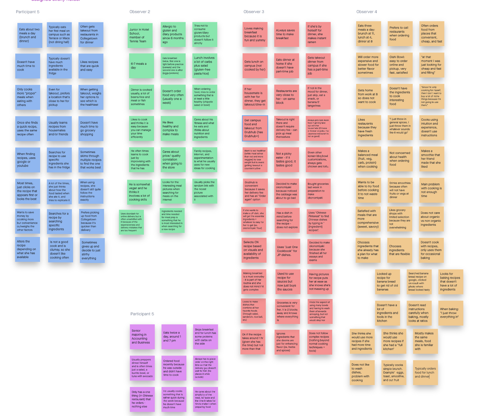
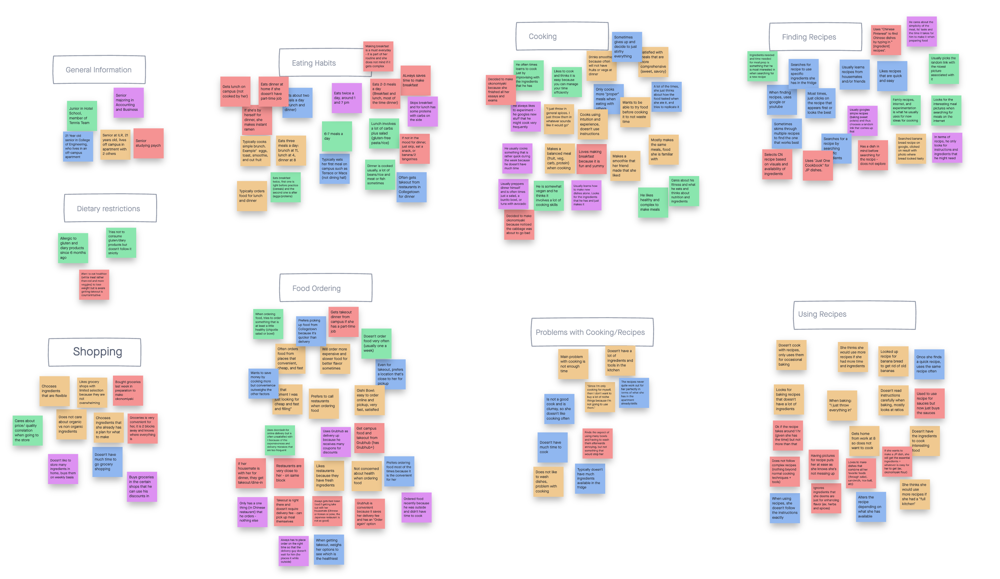
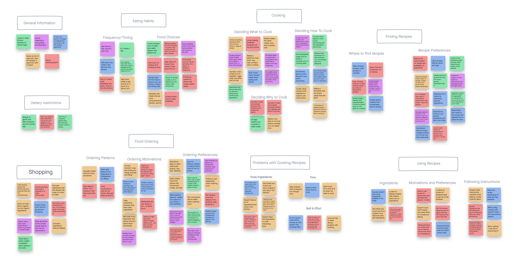

# Discovery and Planning for the Recipe App

## Group Details

- Project Team: Artemis
- Team members: Tomas Engquist, Celina Kim, Rachel Zhang, Konstantin Kirovski
- Project focus: Recipe App

## Introduction

- Overview
  - This file contains the process we used in order to plan our recipe application, starting with user research and ending with creating project themes. Before we started designing our app, we figured out who we are designing it for. Once we determined the user group, we studied the users and learned about and the problems they experience. We then created a several useful tools to guide our design such as value propositions, scenarios, project themes, and personas. This file will show the user research that helped create those tools and the tools themselves.
- Contents
  - Users
    - We conducted initial research to determine which users to focus on and defined the user group with specific details.
  - User Research
    - We interviewed users, summarized the data of each user, combined the data with affinity diagramming, and listed out key findings from all the users.
  - Key Problems
    - We listed out the user problems discovered in research and picked a few to focus on.
  - Value Propositions
    - We listed out value propositions to ensure users would have a reason to use our product.
  - Scenarios
    - We created scenarios to remind us what users want to accomplish when we are designing.
  - Personas
    - We created personas to keep us focused on who we are designing for and prevent us from designing for ourselves.
  - Project themes
    - We created a few project teams to help us stay focused on the central problems during the design stage.
  

## Users

- **College students who live off campus without meal plans and order takeout 4-7 times a week.**
- Determining the user group
  - We conducted quick and informal background research by speaking with six students about the topic.
  - After conducting initial research, we realized that many students don't use recipes very often. We decided to focus on students who order takeout rather than use recipes and cook to figure out what is stopping people from using recipes.
  - The notes of the research are here: [Initial Research](user-research/initial-research.md)
    - Conclusions of initial research
       - After collecting these notes and discussing as a group, we decided to focus on users who don't use recipes often and choose to order food or eat ready made meals.
       - We did this because it seems like many college students prefer not to use recipes and we think that exploring the reasons for this choice can lead to some good insights.
       - We hope to figure out why these people choose to order food, eat out, or make ready made meals instead of shopping for groceries and following a recipe.
       - We also want to understand what kind of recipes and meals college students are looking for.
- Justification
  - This target audience is appropriate for a recipe making app because gathering data on these users will reveal key problems with cooking and using recipes that we can solve.
  - In addition, figuring out why people like to order takeout will help us understand the advantages of ordering that can be incorporated into our app in a different way.
  - While this logic may seem backwards, we have high potential to have an impact on this group. People who already use recipes frequently have many tools and options that they are accustomed to. This is a crowded space for design. Meanwhile, helping those who seldom use recipes has lots of room for impact as they can unlock the benefits of using recipes.

## User Research

- We created an interview script with questions to ask during the user interviews. The questions focus the participant's experience ordering food, cooking food, gathering ingredients, and using a recipe. We wanted to gain a comprehensive understanding of the participants food habits, why they choose particular methods of getting food, and why they avoid others. These experiences and habits will reveal some of the problems around cooking and recipes that we can target.
  - The interview questions can be found here: [Interview Script](user-research/interview.md)
- We interviewed a total of five users using a semi structured interview format. We asked many of the interview questions we came up with but deviated from the structure when appropriate. The names listed below are pseudonyms.

- **Participant 1: Alex**

  - Raw notes: [Participant 1 Notes](user-research/notes/konstantin-participant1.md)
  - Background:
    - Alex is a 22 year old male student at Cornell University who lives off campus. Alex eats 6-7 meals a day and tries to cook at least once a day because ordering food is very expensive. He is a student athlete and cares about healthy food and ingredients that he uses when preparing food.
  - Key Insights:
    - Alex is allergic to gluten and diary products and thus it is difficult to order food because he must keep track of all the ingredients that have been put in the order.
    - Alex tries to order food that is healthy in some way and could be delivered rather fast because this is the main reason that he doesn't cook - he doesn't have enough time for it.
    - Alex experiments when cooking and likes to try different recipes that he finds online. Usually he doesn't follow them word-by-word, but uses pictures on the website to decide which recipe he will choose.
    - Because of his dietary restrictions, he feels he needs to improve his cooking skills because many meals that he would like to order consist of either gluten or diary products.
- **Participant 2: Maddy**
  - Raw notes: [Participant 2 Notes](user-research/notes/tomas-participant2.md)
  - Background
    - Maddy is a 21 year old female student at Cornell University who lives in an apartment off campus. Maddy eats three meals a day, typically cooking the first one and ordering the second and third from restaurants. She prefers ordering food but is willing to cook. When she does cook, she never uses a recipe.
  - Key insights
    - Maddy has many reasons for not cooking and the main one is she does not have time. She also noted that restaurants have fresh ingredients, she doesn't have all the ingredients to cook dishes she wants, and she doesn't like to wash dishes.
    - Maddy orders food that is fast, convenient, and low price. Sometimes she will pay a higher price and wait longer for restaurants with better food. However, speed is very important to her because she doesn't like to wait. She is not concerned with nutrition when she orders food.
    - Maddy almost never uses recipes. Instead, she uses experience and intuition to figure out how cook and season her food. She typically makes the same simple meals so she doesn't need any instructions to prepare them. She makes sure to cook a balanced meal because she knows her takeout order later may not have vegetables, fruit, protein, etc.
    - The only time she uses recipes is to figure out how to get rid of an old ingredient. For example, looking up how to bake banana bread because she had old bananas. She looks up the dish on google and clicks on the recipe with the nicest picture.

- **Participant 3: Nicole**
  - Raw Notes: [Participant 3 Notes](user-research/notes/rachel-participant3.md)
  - Background
    - Nicole is a 21 year old female student at Washington University in St. Louis. She lives off-campus in an apartment with one other housemate. She typically eats three meals a day. She always eats breakfast which she spares time to make everyday, eats lunch from an on-campus location, and either gets takeout from restaurant with her housemate, makes instant ramen, or skips dinner. If she has her part-time job that day, she gets her dinner from on-campus dining. Occasionally, she cooks for dinner in which case she would use a recipe or cook from memory if it is something she made often cooking at home in junior year.
  - Key insights
    - The main reasons she doesn't cook is because she doesn't have time, is lazy, and has a routine to get takeout with her housemate. She likes takeout because she doesn't have to wash a lot of bowls and the takeout food tastes good.
    - She likes that there are restaurants are on the same block she lives on and she doesn't have to pay a delivery fee as she can pick it up herself. Also, her school gives her Grubhub+ which offers free delivery. She is concerned with the nutrition and weight loss benefit when deciding what to order.
    - Her method of selecting a recipe is different depending on the type of food she makes:
      - For Chinese dishes, Nicole uses "Chinese Pinterest" by searching "[her available ingredient] recipe" and picks one based on ingredient availability and visuals.
      - For Japanese dishes, Nicole uses "Just One Cookbook" website and searches exactly for the recipe she has in mind. She will make the recipe with omitted ingredients, buy the essential ingredients, or deem it too long/difficult and not make it.
    - When Nicole does cook with a recipe, she follows the steps and measurements precisely, but is willing to leave out ingredients she deems as nonessential to the dish (ex. herbs and spices)
      - If she really wants to make a particular dish (especially a Japanese dish), she would still buy the essential ingredient

- **Participant 4: Joe**
  - Raw notes: [Participant 4 Notes](user-research/notes/konstantin-participant4.md)
  - Background:
    - Joe is a 23 year old male student at George Washington University and lives off campus with one roommate. He eats 2 meals a day and usually skips breakfast. He usually eats his lunch outside on campus because he doesn't have time to cook during the day. He usually tries to cook in the evenings and he opts for something quick and easy-to-make. He doesn't care whether it is considered healthy or not - he eats whatever he feels eating at that time.
  - Key Insights:
    - Joe's main reason for not cooking enough is that he does not have time to do it. This includes the time needed to cook and to get necessary ingredients to prepare the meal.
    - When Joe cooks, he experiments a lot and plays with the ingredients that he has. He doesn't necessarily follow a specific recipe but may look one up for inspiration.
    - Joe looks for the recipe to get the clear instructions on how to make a certain dish that hasn't made before. For example, he mentioned that he didn't know how to bake sweet potato and he had to google a recipe that includes it to figure it out.
    - Joe only orders a food that is already known to him. He mentioned that he has only one meal that he orders from a chinese restaurant. He does not like to experiment when ordering food because his stomach can react badly to the new food sometimes.
    - When ordering food or looking up for the recipes, it is important to him that food is made/delivered quickly. He does not want to waste time because he doesn't have much of it.

- **Participant 5: Cindy**
  - Raw Notes: [Participant 5 Notes](user-research/notes/celina-participant5.md)
  - Background
    - Cindy is a 21 year old female student at the College of Engineering at Cornell University. She lives at an off-campus housing with three other housemates. Cindy typically eats two meals a day (brunch and dinner), and prefers to eat brunch somewhere on campus and ordering food from restaurants for dinner. Much of her decision to order food comes from not having enough time to cook and not having enough ingredients at home. She sometimes still cooks but prefers cooking something that is quick and easy.
  - Key insights
    - The main reason why she does not cook is because she does not have time and does not have the necessary ingredients in her fridge to cook. Even when getting food from restaurants, she prefers to go somewhere that is nearby and does not take too long to make food.
    - Though not often, she does look up recipes to find dishes to cook based on the types of food that she has left in her fridge. She mainly uses recipes for "inspiration" more than following a step-by-step tutorial, because the chances are likely that she does not have everything the recipe calls for.
    - Does not really like looking up new recipes because cooking new recipes tend to take longer than cooking recipes she already knows and requires her to have (ideally) the exact ingredients and follow the steps exactly.
    - Gets most of her recipes from her housemates/friends/family more than searching it up herself. When she does search it up herself, sometimes she skims through multiple recipes to find what works the best for her, but most times she's too lazy to look through so she clicks on the one that shows up first or looks the best.
- **Affinity Diagraming**
  - Stage 1: Creating post it notes
    - After we collected data from users in the user interviews, we transferred the important data onto post it notes on the site Invision. It is important to combine all the data into one place in addition to studying user data individually so we can take note of common trends and issues.
    - 
  - Stage 2: Sorting into groups
    - We then re-organized the post its so that similar ones were grouped together. We ended up separating the data into these groups: general information, dietary restrictions, cooking, finding recipes, using recipes, shopping, food ordering, and problems.
    - 
  - Stage 3: Sorting groups into subgroups
    - Because our groups had so many post it notes, we decided to look into each group and create subgroups. When we refer to the affinity diagram in the future, this will make it easier to identify certain behaviors or motivations we want to focus on.
    - 

- **Executive Summary of Key Points**
  - Eating habits
    - Eat enough for their health needs and cares about the nutrition value and taste of their meals
  - Cooking
    -  Prefers simple dishes (include ones they make often) that fulfill their nutritional needs
    - Does not follow strict steps as they cook, just throw things together to get a meal done
  - Finding Recipes
    - When searching for recipes, they pick recipes that has pretty visuals and look simple (easy steps and common ingredients) 
  - Dietary restriction
    - They exist, but are not the their main concern
  - Shopping
    -  They shop for limited set of ingredients for dishes they already have in mind or are common in multiple dishes
  - Food Ordering
    - They order takeout to prioritize convenience and time 
    - They want to eat a meal they know is filling and good tasting in the least amount of time
  - Problems with Cooking/Recipes
    - They don't want to have to spend too much time after a long day of school/work on top of assignments
    - They feel limited by their ingredients and tools when they want to cook
  - Using Recipes
    - They look for recipes that use the ingredients they already have
    - When cooking again, they use the recipe they know is understandable, reliable and consistent
    - Don't care about following the recipe exactly

## Key Problems

- Initial problem brainstorm
  - We reviewed our affinity diagraming, paying specific attention to the problems group we created. We then jotted down multiple problems that we could potentially focus on:
    - Not having enough time to cook
    - Not having the necessary ingredients to cook certain recipes
    - Not having the necessary tools or skills to cook certain recipes
    - Following recipes take longer than cooking what they already know
    - Too many recipes (online) to look through to truly find the one that works for them
    - Users value their time and effort more than money when deciding what to eat
- **Key problems to focus on**
  - **Problem 1: Cooking and using recipes takes too long compared to ordering food and the user group has limited time**
    - Justification
      - This was by far the most frequently observed problem among the participants from user research. College students are very busy and often do whatever possible to make time to study or sleep more. This is a big obstacle to cooking, as students perceive cooking as an activity that takes too long. If students do not cook, then they certainly won't use a recipe. In addition, students take shortcuts when they use recipes to save time. For example, they don't read all the steps or measure out ingredients. This makes time even more important of an issue to focus on for a recipe application.
  - **Problem 2: Cooking and using recipes requires ingredients and kitchenware that college students don't have whereas only money is needed for takeout.**
    - Justification
      - This is another problem that users frequently mentioned. They experienced that using recipes requires many specific ingredients and cooking tools that they don't have. They don't want to invest in specific kitchen tools that may not be used beyond one dish. In addition, students are hesitant to buy specific ingredients they are not confident they can use often. In the meantime, money can be used to order food, a resource that students do have.

## Value Propositions

- The app has recipes that take into account the limited tools and kitchenware college students have. Alternative products often offer highly rated recipes but they require more resources.
- The recipes only use basic and common ingredients, including easy alternatives if the student is missing an ingredient. Other recipe sources assume users have many ingredients available.
- Gets college students motivated to make home cooked meals, saving money without sacrificing their time. Ordering food is usually more expensive than cooking.
- The app introduces new recipes that are convenient and easy to make. College students often eat the same meal every week and would appreciate some variety. Alternative sources have a bigger variety of recipes but they are not as convenient.
- The app prioritizes student's time, allowing them to create quick meals that won't get in the way of schoolwork.

## Scenarios 

  - Scenario 1:
    - Ashley is an undergraduate student at Cornell University who lives off-campus and is not enrolled in Cornell's meal plan. Thus, to save money, it is important that Ashley cooks meals for herself. Cooking the same meals over time becomes boring for her, so she wants to experiment with online recipes. However, Ashley is worried that finding recipes and preparing food may take a lot of her time. Meal preparation is very important for her, but she wants to make sure that it doesn't take too much time so she can study. Ashley decided she only had 15 minutes to make her meal. Ashley used the recipe app to find a recipe she liked that only took 15 minutes and she found that banana bread matched her criteria. Since she had all the ingredients and relevant skills to make it, she decided to make it. After successfully baking banana bread, Ashley felt good that she was able to save her time and money by preparing a quick, but delicious meal of her choice instead of ordering food online. 

  - Scenario 2:
    - Daniel is a junior at Cornell University who just moved out of the dorms this semester and is not enrolled in Cornell's meal plan anymore. Thus, he usually goes to the store once a week to buy certain ingredients that he thinks he could use during the following week. He does not have a list of items that he needs before going to grocery store and he usually buys stuff that he sees while walking around. After coming home, he found that the ingredients were difficult to figure out how to pair together. Using the app, he was able to find a recipe using the ingredients he had just bought, making him feel satisfied with the choices he made during his grocery shopping. 
    
  - Scenario 3:
    - Kelly is an upperclassmen at Cornell University who lives at an off-campus studio far from campus. Since she lives far, she spends most of her day on campus and resorts to purchasing food from restaurants or from stores on campus. She wants to start cooking more and perhaps plan her meals to save money. It's been about a week since she went grocery shopping, and she has very little ingredients left in her fridge. Additionally, because she lives alone and doesn't normally cook often, she has very limited tools she can use to help her cook. Using the app, Kelly came across a very simple recipe that she was able to cook in between her classes. She didn't have all the main ingredients but she saw there were several alternatives listed and she had those alternatives in her fridge. She was very happy that she was able to eat a good meal while saving money. She hopes to find more recipes like the one she found so that she can cook more and not waste the food in her fridge as well.

## Personas

- **Persona 1: Ashley, an undergraduate student at Cornell University**
  - Ashley is a busy upperclassmen at Cornell University, who is on campus most of the time and does not have much time to cook. She buys a lot of her meals at restaurants or on campus but wants to start cooking more and start bringing food from home.
  - 
    - She has intermediate computer/app literacy
    - She has basic experience and knowledge in cooking
    - She usually buys the same ingredients whenever she goes grocery shopping
    - She is always busy and in hurry and wants to save time in every aspect that she can
    - She usually cooks for about 2-3 meals a week
    - She rarely uses recipes when she cooks -- cooks things that she already knows how to make
    - When she does look for a recipe she doesn't like to spend more than 5 minutes looking for the one she likes
    - She likes to cook food that takes less than 20 minutes to make
    - She does not follow the recipe accurately when she uses it
    - She usually only cooks for herself
    - She eats in between classes or while doing other work
    - She started to care about her health more, so she wants to start eating healthier by preparing her own food
- **Persona 2: Brett, a working, grad student**
  - Brett is in his first year as a graduate student. He is in a new school for his graduate program and is not familiar with the area. He is working a part-time job on top of his education because he needs to save up money.
  - 
    - He has basic computer/app literacy
    - He has limited experience and knowledge in cooking
    - He only buys ingredients that he knows he will eat/use
    - He wants to find meals that he can cook with ingredients he has in the fridge
    - He is getting tired of his food and wants to find new easy recipes
    - He doesn't want to spend money on niche ingredients that he will use only once
    - He prefers to eat simple meals at home to save money
    - He does not know how to drive and doesn't know other methods to go grocery shopping other than Uber
    - He doesn't have many recipes memorized; he eats the same three dishes
    - He has time in the afternoon and evening set aside to cook and eat his meals
    - He does not own many kitchen utensils 
    - He needs to save money to pay his tutiton, so really wants to save money on food by reducing takeouts
    - He has a fairly managable schedule this semester and works three times a week

## Project Themes

- **Speed**: The user will be able to accomplish their goal with the app in a short amount of time
- **Encouragement**: The app will give users encouragement and assurance that the recipes will not take too long.
- **Steps**: The user will be able to reach their goal on the application (fining a recipe) with just a few interactions (taps, swipes etc.).
- **Self-explanatory**: the app will not require external research to use and understand.

- Justification
  - The project themes all tie into the central user problem: time. Focusing self-explanatory features with limited steps will allow the user to accomplish their goal quickly. Everything that we design can use these themes to stay grounded in the goal of providing fast solutions. In addition, features should keep in mind that encouragement is vital to users. User research has informed us that the convenience and speed of ordering food outweighs the benefits of cooking. If the users are not assured of that using the app and its recipes is fast, there is no reason for them to switch methods.
