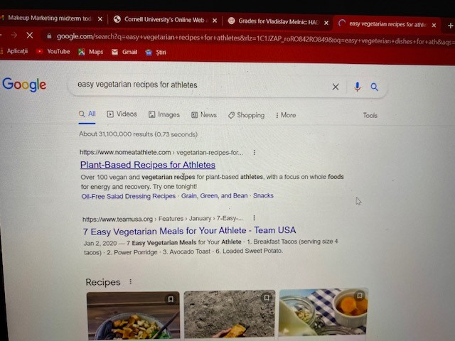
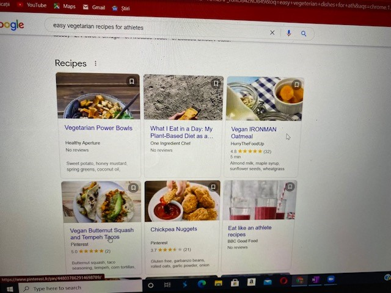
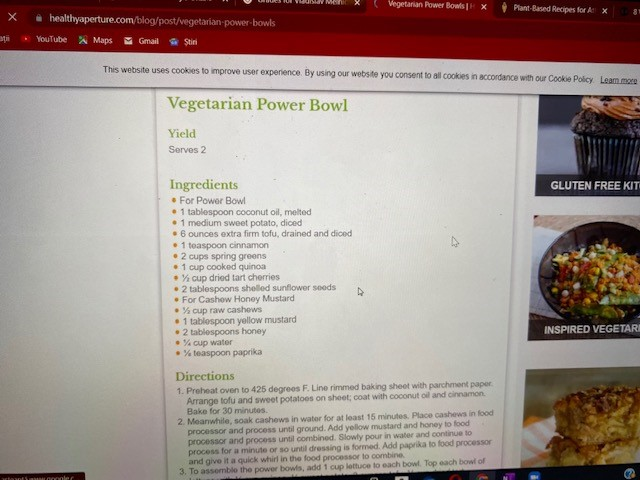
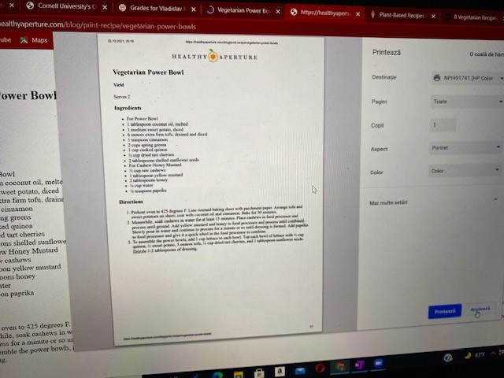

Interview: 
1. Introduction
Hello! We are students in Info 4340 and are looking to develop an app for those who frequently order takeout instead of cooking. The interview will consist of few questions regarding your experience ordering food and preparing meals. This interview will last approximately 30 minutes. Please know that you do not have to answer all the questions and feel free to stop us if you feel uncomfortable at any point. All information is confidential and will not be shared with anyone else. Before we get started, are you okay with this interview being recorded? 

2. Core questions
- Please tell us your name, age, and occupation?
    - 22 year old, junior in Hotel School, member of Cornell's Mens Tennis team
- Do you have any dietary restrictions?
    - If yes: yes, alergic to diary products and gluten 
    - What are your reasons for following the said dietary restriction?
        - Significantly decreased the amount of diary products (no milk, goat cheese) - parmesan is the only cheese that he eats. When it comes to gluten he tries to be careful (he eats it but decreases the amount). Kind of following the vegeterian diet because he felt the need to decrease the meat consumtpion because he feels it would benefit his performance on the court
    - How long have you had this restriction? 
        - the last six months

- Could you please describe your eating schedule? (How often do you eat each day, at what times, which meals, etc.)
    - Always has an early light breakfast (oatmeal or cereals around 6.30/7am), after the practice would have the second breakfast around 10, would have eggs, avocados, some ham and then would eat snack (almonds, peanuts, walnuts, fruits, etc.) around 11, and then lunch around 1pm is rice, soup, beans, vegetables or gluten-free pasta. Around 3 pm he has another snack something like a bar, sweet, cookie, or smoothie before tennis so he has energy. Around 7pm he would eat dinner which would be a lot of beans, vegetables, quinoa/rice, maybe chicken/fish/salmon sometimes. Hummus with carrots around 9pm, or ice cream if he feels like it
    - Has around 6 meals a day because he trains a lot

- Tell me about your most recent experience ordering your food (when was it)?
    - Why did you decide to order the food?
        - a week ago, craving chipotle and he was really tired to cook and just decided to eat something pretty decent (healthy) and vegeterian quickly
    - What did you choose to eat and why? 
        - Raelly wanted a chipotle meal that is somewhat healthy
    - Were you satisfied with the meal that you ordered?
        - It was alright, not amazing. A lot of restaurants lack quality when delivering food
    - What were some difficulties while ordering and receiving this meal?
        - pretty expensive, overpriced and he hates it. Burrito bowl is like $8.5 with taxes and then a delivery and tip it comes too expensive for him.
        - Delivery driver actually messed up and he had to wait 20 more mins which is very inconvenient
    - Is this a meal you order frequently? If so, why?
        - Not really

- Tell me about your most recent experience preparing your food (when was it)?
    - What did you choose to eat and why?
        - Today, earlier in the day. It was good, and he thinks it is easy to make for yourself because you manage your time. 
        - Beans with tomato sauce and oregano, with baked sweet potatos and a salad with lettuce/parmesan/lettuce. Pretty complex meal in his opinion and he gets enough ingridients that he thinks are necessary for his body
    - Were you satisfied with the meal that you prepped?
        - Very satisfied. He is always satisfied with his meals because he knows how to cook
    - What were some difficulties while preparing this meal?
        - No difficulties. Says he never experiences any
    - Is this a meal you make frequently? If so, why?
        - twice a week. It is tasty and pretty easy
    - How did you learn how to make this dish?
        - Imrpovization, playing with ingredients that he has

- Based on the experience that you just mentioned, how did you get the ingredients to make this meal?
    - Where did you get the ingredients? 
        - wegmans, he went to wegmans
    - How long did it take? 
        - usually it takes an hour when you go to buy groceries (sometimes 30 minutes when you have a list). Does this on a Sunday and buys everything for the week
    - Why do you choose this method/store?
        - Wegmans has the most ingredients and products that he needs. Price and quality is good (pricey but the quality is good)

- What are some ways you find new recipes?
    - Sometimes just experiment with the ingredients.
    - Family cooking book, talking to relatives
    - Internet
        - search the main product that he wants to cook (wants to mate a dish out of zuccini) - he would search zuccini dishes or something like that
- What do you look for in particular in a new recipe?
    - Taste, different taste because he likes to experiment and experience new taste. Really into cooking and likes to try something new always
- When was the last time you used a recipe? - Two weeks ago
    - Describe the most recent experience when you used a recipe?
        - He made a vegan roasted sweet potato salad and a green curry bowl. He had to cook the rice, dice the vegetables and had to prepare the curry and he needed cashew and all other ingredients (lemon grass, cilantro, ginger, etc.). Sauce was pretty straightforward. Boiled the broccoli before adding it to the pan with the mushrooms and other stuff. Added a little bit of buter and top it all over the rice and you get a bowl. As for the salad he would need roasted sweet potatoes, kale salad, and romain lettuce 
    - How did you find the recipe? Was it useful? Why was it useful or not?
        - He liked it and he thinks it is useful for those that are trying to follow specific vegeterian diet. When it comes to being vegan, you need to know how to cook (it is too easy to make meat and something on the side). If you're an athlete with those restrictions you need to cook a little bit. He googled (dont remember the specific site), wrote down ingredients and made it 
    - What difficulties did you encounter?
        - There were no difficulties
    - Why did you choose to use the recipe? What was the motivation for that?
        - He thought it was interesting, tasty and easy to make for him

- Could you please demonstrate to us how do you find a new recipe? (take photos)
    - If you feel comfortable, could you please share your screen and demonstrate the process for us?
        - Googles 'easy vegeterian recipes for athletes'
            - 
        - expands the images that are shown and opens couple of interesting links in the new tabs
            - 
        - finds the 'Vegeterian Power Bowl' the most interesting one and opens it up
        - sees the image and it looks tasty to him
        - doesn't read the description (long one) and scrolls down to ingredients usually to see if he has everything 
            that is needed for the preparation
            - 
        - reads the description on how to make this meal and actually tries to print it - it is easier to have it on paper 
            next to him when cooking
            - 
- Could you please demonstrate to us how you order food? 
    - Goes on doordash app and looks for different somewhat healthy meals
    - doesn't prefer this because he likes to cook and it is healthier
    - chipotle is the least bad thing and decides to go for it
        - finds the salad and burritos (without meat) the most appealing
        - adds it to cart and seems pissed about the price - too expensive for him
        - adds and goes to complete and place order (doesn't actually place it)
[if they don't order nor look for recipe]
- Could you show us a tour of how would you cook the dinner for tonight? (You don't have to do it actually.)

- Is there anything relevant that you would like to add? 
    - If you are trying to get into the vegan/vegeterian diet then you better learn how to cook. 
- Thank the users for their time and help that they provided during the interview. 